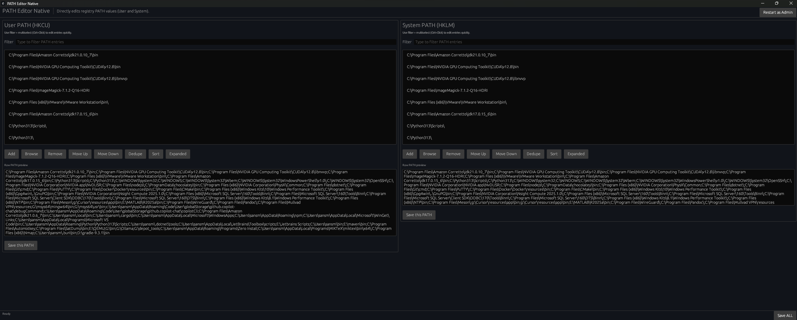

# Path Editor Native

Windows-native desktop app for editing `PATH` in the registry with a modern UI.



## Features

- Edit both User PATH and System PATH
- Add, browse, remove, and reorder entries
- Filter entries and multi-select with `Ctrl+Click`
- Dedupe and sort actions
- Expanded value preview (`%VAR%` expansion view)
- Save per-section or save both
- Elevation flow for System PATH writes
- Broadcasts `WM_SETTINGCHANGE` after save so new processes can see updates
- Bypasses default Windows PATH editor GUI max length

## Tech Stack

- Rust (`edition = 2021`)
- UI: `eframe` / `egui`
- Windows integration:
  - `winreg` for registry access
  - `windows` crate for Win32 calls
  - `rfd` for native file/folder and message dialogs

## Project Layout

- `src/main.rs`: Application logic and UI
- `scripts/package.ps1`: Build/package automation script
- `installer/path_editor_native.iss`: Inno Setup installer script

## Requirements

- Windows
- Rust toolchain (`cargo`)
- Optional for installer output: Inno Setup 6 (`ISCC.exe`)

## Run in Development

```powershell
cargo run
```

## Build Release

```powershell
cargo build --release
```

Release binary output:

- `target\release\path_editor_native.exe`

## Packaging

Build portable zip + installer:

```powershell
powershell -ExecutionPolicy Bypass -File .\scripts\package.ps1
```

Build portable zip only:

```powershell
powershell -ExecutionPolicy Bypass -File .\scripts\package.ps1 -SkipInstaller
```

Outputs (versioned):

- `dist\PathEditorNative-<version>-win64.zip`
- `dist\PathEditorNative-<version>-win64.zip.sha256.txt`
- `dist\PathEditorNative-Setup-<version>.exe` (when Inno Setup is available)

## Notes

- User PATH updates do not require admin.
- System PATH updates require elevation.
- Existing terminals typically need restart to pick up new PATH values.

